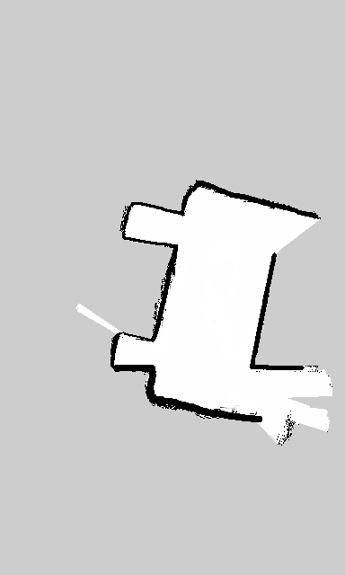
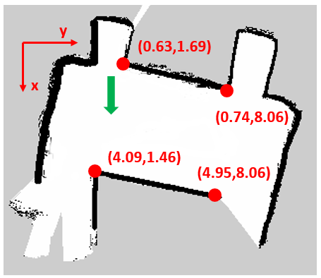

# Project : SLAM-Robot Using ROS-Kobuki-Turtlebot
The project is done at University of Alberta (UoA) for the course CMPUT 412: Experimental Robotics.

## Overview
The robot builds a map of the environment and moves along a four corner loop with RGB camera.


## Dependencies
We tested our project on the following environment.
* Ubuntu 14.04
* Python 2.7.6
* ROS Indigo
* Numpy
* OpenCV-Python 2.4.8
 

How to configure Joy:
http://wiki.ros.org/joy/Tutorials/ConfiguringALinuxJoystick

## How to run 
### Collect map 
Run the following to change the gmapping parameters to different values. These adjustments changes how far the robot rotates and moves before a new scan is considered for inclusion in the map. It also adjusts the number of beams to skip when processing each laser scan message, and the extent of the map dimensions. The following change in parameters yielded good map results.
```
roscd turtlebot_navigation/launch
cp gmapping_demo.launch ~/copyDestinationName
roscd turtlebot_navigation/launch/includes/gmapping
cp gmapping.launch.xml
roslaunch folderName gmapping_demo.launch

<param name="lskip" value="10"/>
<param name="linearUpdate" value="0.1"/>
<param name="angularUpdate" value="0.1"/>
<param name="xmin" value="-10.0"/>
<param name="ymin" value="-10.0"/>
<param name="xmax" value="10.0"/>
<param name="ymax" value="-10.0"/>
```
Run the following to record, save and display map image. 
```
roslaunch turtlebot_bringup minimal.launch
roslaunch gmappingSavedFolderName gmapping_demo.launch
roslaunch turtlebot_rviz_launchers view_navigation.launch
rosrun map_server map_saver -f /destinationFolderName/MapName
roscd folderMapSaved 
rosrun rviz rviz
```
At first we thought of cropping the north end of the map from our last demo as our new map for the competition. However, the quality of the north end area of the map is poor even if we tried to edit the image. This is because GMapping takes sensor data (laser scan and odometry) as input, and continuously computes the map as the robot moves around. Because the sensor data is subject to noise, the map will be inaccurate. Sometimes the error is very large thus make the map unusable. Therefore, we made a new map of just the north end of the second floor. We also manually removed some noises and corrected the edges from the map using GIMP. 

<div align="center">
    
</div>

### Localization and Navigation
We teleoperated the robot, and subscribed to the /amcl_pose topic to determine the position and orientation of the robot at the 4 corners of the map. Then based on the floor grid, we determined that each square corresponded to a distance of 1.6 in the map. This is also how we deteremined to set the waypoint coordinates in our code for the robot to navigate to in the map. But before the robot can navigate, it needs to first localize its position in the map. This initial pose can be set using the global localization with rosservice call, or locally using the 2D pose estimate in RVIZ. The 2D pose estimate method was used as it is a faster method for the robot to guess its initial location, and prevents the situation where initial localization fails. Therefore, using the 2D pose estimate, we manually set the initial pose (which can be anywhere in the map) as accurately as possible to its actual location in RVIZ. 
After setting the waypoints and initial pose, the amcl algorithm performs the localization and navigation. AMCL uses a particle filter, a laser scan and the map created to compare the data from the sensor with the map to determine its location in the real world. If the coordinates from the real world and the map are closely matched, it increases the probability of the pose at that location, so the pose is used to plan the path. Therefore, the pose that is used to plan the path is the one with the highest probability. 

Run the following to start localization and navigation.
```
roslaunch turtlebot_navigation amcl_demo.launch map_file:=/locationMapFile/mapName.yaml
rostopic echo amcl_pose
```
<div align="center">
   
</div>

## Improvement
We adjusted the linear and angular speed by adjusting the move base launch file. We also refined all the edges in the map to ensure there are enough distinguishing features for the AMCL module to accurately determine the robot's pose. 

## Trial after the competition
The video below shows the trial after the competition. We re-calibrated the goal positions and completed the race. 

## Performance Video
<div align="center">
  <a href="https://www.youtube.com/watch?v=swXw8rr6-7I"></a>
</div>

## Discussion
The amcl mapping looses its localization if there are too many obstacles in the map.We have found that cleaning the map helps in the path planning.Usually the paths are in between 2 obstacle onboth sides.So if there is any wall type object in the map as noise,it generates curve path insetead of possible linear one.Changing the speed also effects the localization especially moving in free space without suffficient landmarks as it effects robots kinematics with respect to the map.The robot can be lost if its in the middle of free space and finds no landmarks around.

## Future Work
Using the vision information to avoid the cones might help.The cones are visible in depth sensor. Using this info, dynamic path locations can be generated instead of predefined fixed path.When amcl looses track, the robot can initiate wander behavior until it reaches any wall around and the amcl will be able to localize with respect to the landmarks present in it.

Using 3D visual SLAM will enhance the robustness of system for the task given above.

## Authors

* [Nazmus Sakib](https://github.com/nsa31)
* **Vivian Ting**
## Acknowledgement 

* [Programming Robots with ROS](https://github.com/osrf/rosbook/blob/master)

